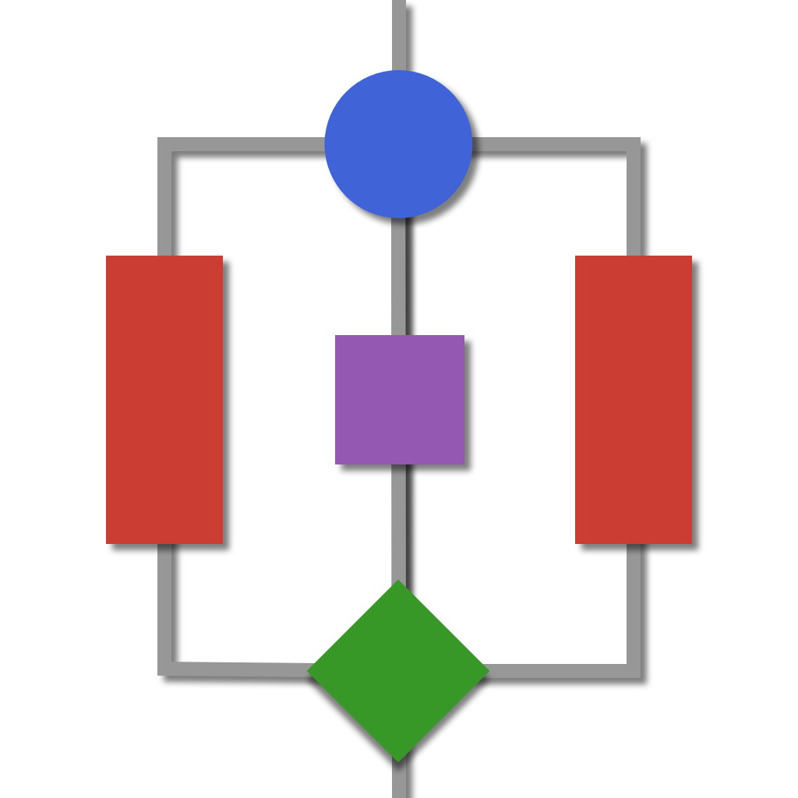

<p align="center">
  <a href="" rel="noopener">
 </a>
</p>

<h3 align="center">AlgorithmsCollection.jl</h3>

<div align="center">

| **Documentation** | **Build Status** | **Style**|
| :---------------: | :--------------: | :------: |
| [](https://Julia-Algorithms.github.io/AlgorithmsCollection.jl/stable) [](https://Julia-Algorithms.github.io/AlgorithmsCollection.jl/dev)| [](https://github.com/Julia-Algorithms/AlgorithmsCollection.jl/actions) [ branch](https://img.shields.io/travis/com/Julia-Algorithms/AlgorithmsCollection.jl/main?logo=travis))](https://travis-ci.com/Julia-Algorithms/AlgorithmsCollection.jl) [](https://codecov.io/gh/Julia-Algorithms/AlgorithmsCollection.jl)|[](https://github.com/invenia/BlueStyle) [](https://github.com/SciML/ColPrac)|

</div>

---

<p align="center"> A set of classic and modern Algorithms reimplemented in JULIA.
    <br> 
</p>

## 📝 Table of Contents

- [About](#about)
- [Getting Started](#getting_started)
- [Usage](#usage)
- [Example](#example)
- [Requirements](#requirements)
- [TODO](../TODO.md)
- [Contributing](CONTRIBUTING.md)
- [Authors](#authors)
- [Acknowledgments](#acknowledgement)

## 🧐 About the `AlgorithmsCollection.jl` <a name = "about"></a>

`AlgorithmsCollection.jl` is a reimplementation of classic computer algorithms in `JULIA`. The main focus is to combine and highlight the three major benefits of `JULIA`:

1. Functionality
2. Performance
3. Maintainability

Consequently, more pure `JULIA` and less `import`.

## 🏁 Getting Started <a name = "getting_started"></a>

AlgorithmsCollection is a registered package and so can be installed via `Pkg.add`.

```julia
Pkg.add("AlgorithmsCollection")
```

This package supports Julia `≥1.5`.

## 🎚 Usage <a name = "usage"></a>

To use `AlgorithmsCollection.jl` in your project,

```julia
using AlgorithmsCollection
```

### 📚 Accessing Documentation from REPL

All docs found here can also be accessed via REPL through Julia's help functionality.

```julia-repl
julia> using AlgorithmsCollection
```

## 🧪 Example: _The binary pivot search_ <a name = "example"></a>

```julia
julia> import AlgorithmsCollection
julia> arr = [2, 5, 4, 7, 2, 8, 9, 3, 10, 2]
julia> target = 3
julia> AlgorithmsCollection.binary_pivot_search(arr, target)
8
```

## ⚙️ Requirements <a name = "requirements"></a>

- [Julia](https://github.com/JuliaLang/julia) - Language ≥ 1.5

## ✍️ Authors <a name = "authors"></a>

- [@Anselmoo](https://github.com/Anselmoo)

See also the list of [contributors](https://github.com/kylelobo/The-Documentation-Compendium/contributors) who participated in this project.

## 🎉 Acknowledgements <a name = "acknowledgement"></a>

- [@Geeksforgeeks](https://www.geeksforgeeks.org/top-10-algorithms-in-interview-questions/)
- [@kylelobo](https://github.com/connietran-dev/readme-generator) For the **README.md** generator
